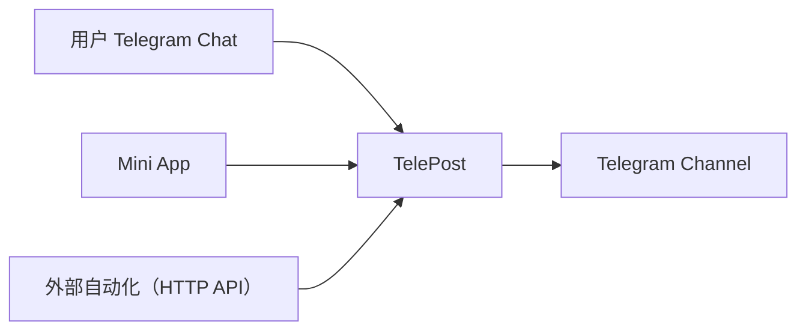
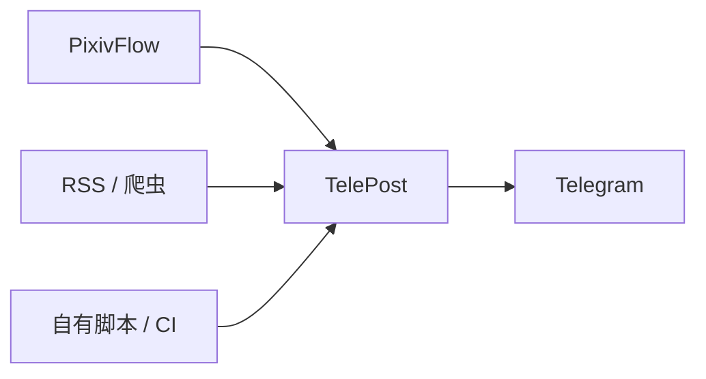

# TelePost

**语言 / Language:** 中文 · [English](README.en.md)

> **Telegram 频道投稿、审核与自动化发布平台。**

[完整文档](https://redtidev1918.github.io/TelePost/)

[](https://github.com/redtidev1918/TelePost/releases/latest)
[](LICENSE)
[](https://www.python.org/)
[](https://redtidev1918.github.io/TelePost/)

用户可以通过 Telegram 聊天或 Mini App 投稿，管理员可以集中审核和管理内容；
外部程序也可以通过 HTTP API 自动投递。所有入口共用同一套投稿、审核、搜索、发布和状态管理流程。
TelePost 可以独立运行，不要求 PixivFlow、Fly.io、Mini App 或多 Bot。

## 目录

- [适用场景](#适用场景)
- [30 秒开始](#30-秒开始)
- [功能](#功能)
- [Telegram Mini App](#telegram-mini-app)
- [HTTP API 与自动化](#http-api-与自动化)
- [运行与部署](#运行与部署)
- [面向长期运行](#面向长期运行)
- [文档](#文档)
- [相关项目](#相关项目)
- [致谢](#致谢)
- [贡献与许可](#贡献与许可)

## 适用场景

| 场景 | 流程 | 适合 |
| --- | --- | --- |
| 社区频道 | 成员 → Bot / Mini App → 直接发布或审核 → 频道 | 社区投稿、作品征集、UGC 频道 |
| 自动内容频道 | PixivFlow 等工具 → HTTP API → 审核 → 频道 | 自动收集内容并保留人工把关 |
| 自定义自动化 | RSS / 爬虫 / CI / 自有脚本 → HTTP API → 频道 | 把 Telegram 作为现有工作流的发布端 |



Chat、Mini App 和 API 不是三套系统：它们最终进入同一个 TelePost 业务流程。Mini App 是可选的增强界面，
审核也是可配置策略；原生 Chat 投稿默认直接发布，设置 `CHAT_REVIEW_REQUIRED=true` 后才进入审核队列。

## 30 秒开始

1. 在 [@BotFather](https://t.me/BotFather) 创建 Bot，并把它加入目标频道、授予发帖权限。
2. 从 [最新 Release](https://github.com/redtidev1918/TelePost/releases/latest) 下载当前平台的单文件程序。
3. 首次运行并按向导填写 Bot Token、频道 ID，以及推荐设置的 Owner ID。
4. 向 Bot 发送 `/start`，再用 `/submit` 完成第一次投稿。

Linux 示例：

```bash
chmod +x telepost-linux-x64
./telepost-linux-x64
```

也可以使用 Docker 或源码运行；各平台下载、安装和升级方式见[安装与部署](docs/INSTALL.md)。

## 功能

- **投稿与发布**：图片、视频、音频和文件；支持预览、编辑、标签、匿名和剧透。
- **按来源可信度审核**：Chat 直发默认直接发布（可配置审核）；API 自动化投稿**固定**进入私有审核群；Mini App 由独立的 `MINIAPP_REVIEW_REQUIRED` 控制，不与 API 共用开关。审核员可以编辑后发布，投稿者原稿保持不变，见 [编辑后发布](docs/CONFIGURATION.md)。
- **Mini App**：普通用户投稿并查看自己的投稿，审核员处理队列和详情。
- **HTTP API**：Bearer Token、幂等键、文件上传和 Telegram `file_id`，适合脚本与自动化服务。
- **频道管理**：搜索频道历史、标签、个人投稿和本地热榜，并提供常用管理命令。
- **多 Bot**：一个 supervisor 运行多个相互隔离的 Bot，各自使用独立配置与数据目录。
- **运行方式**：支持 Polling、Webhook 和自动选择，部署不绑定特定云平台。

## Telegram Mini App

```text
普通用户：Telegram → Mini App → 投稿 / 我的投稿
审核员：  Telegram → Mini App → 审核队列 / 审核详情
```

Mini App 复用 Bot 的身份、投稿和审核流程，不是第二套后端；关闭 Mini App 不影响聊天投稿和 HTTP API。
当前 Mini App 投稿界面按审核流程工作；`MINIAPP_REVIEW_REQUIRED` 内置默认即为 `true`（与 `API_REVIEW_REQUIRED` 相互独立）。
启用方式、同域托管与安全要求见 [Mini App 文档](docs/MINIAPP.md)。

## HTTP API 与自动化

外部程序可以把 TelePost 当作 Telegram 的投稿、审核与发布后端。先由 Owner 在 Bot 中执行
`/gen_token <名称>` 生成 Token，然后提交内容：

```bash
curl -X POST 'https://example.com/api/v1/submissions' \
  -H 'Authorization: Bearer tp_xxxx' \
  -F 'files=@image.jpg' \
  -F 'tags=illustration,featured' \
  -F 'title=Example' \
  -F 'idempotency_key=my-source:123'
```

多 Bot 路径、审核策略、响应语义和完整字段见 [HTTP API 文档](docs/API.md)。

### 与其他工具配合

TelePost 可以完全独立运行，也可以接收任何能调用 HTTP API 的上游：



[PixivFlow](https://github.com/redtidev1918/PixivFlow) 是一个独立的 Pixiv 下载、筛选与自动收集工具；
它可以把结果交给 TelePost，也可以本地下载或投递到其他接收端。**TelePost 不依赖 PixivFlow。**

可选的 [MCP sidecar](docs/MCP_REVIEW.md) 允许 AI Agent 读取待审核内容并给出建议；最终发布仍由人类明确确认。

## 运行与部署

TelePost 可以运行在本地、VPS、Docker、Fly.io 或其他能够运行 Python / 容器的环境：

| 环境 | 建议入口 |
| --- | --- |
| 本地或无公网 HTTPS | `RUN_MODE=POLLING` |
| VPS / 容器平台 | Polling，或在公网 HTTPS 后使用 Webhook |
| Fly.io | 固定版本镜像、持久卷和 Webhook |

单 Bot 是最简单的起点；Mini App、多 Bot、Webhook 和 PixivFlow 组合都按需启用。通用步骤见
[安装与部署](docs/INSTALL.md)，Fly.io 专项配置见 [Fly.io 部署](docs/FLYIO_DEPLOYMENT.md)。

## 面向长期运行

- 投稿和发布使用幂等语义，重试不会静默产生重复内容。
- 审核状态、会话和运行时策略持久化，重启后可以恢复。
- `/live`、`/ready`、`/health` 提供分层健康检查。
- 图片处理有资源预算，高风险原图会安全降级为预览或文档。

## 文档

| 你想做什么 | 文档 |
| --- | --- |
| 下载并开始使用 | [下载](docs/download.md) · [安装与部署](docs/INSTALL.md) |
| 配置 Bot、审核或多 Bot | [配置参考](docs/CONFIGURATION.md) |
| 查看 Telegram 命令 | [命令参考](docs/COMMANDS.md) |
| 接入自动化 | [HTTP API](docs/API.md) |
| 启用 Mini App | [Mini App](docs/MINIAPP.md) |
| 配置 Webhook 或 Fly.io | [Webhook 与 Polling](docs/WEBHOOK_MODE.md) · [Fly.io 部署](docs/FLYIO_DEPLOYMENT.md) |
| 备份、升级或排查故障 | [运维手册](docs/OPERATIONS.md) · [故障排查](docs/TROUBLESHOOTING.md) |
| 参与开发 | [贡献指南](CONTRIBUTING.md) · [完整文档目录](docs/README.md) |

## 相关项目

- [PixivFlow](https://github.com/redtidev1918/PixivFlow)：Pixiv 下载、筛选、定时执行与 HTTP 交付工具。
- [pixivflow-telepost-deploy](https://github.com/redtidev1918/pixivflow-telepost-deploy)：组合 PixivFlow 与 TelePost 的部署和运维套件，提供 Docker、VPS 与云平台配置示例。

## 致谢

TelePost 建立在这些项目之上：

- [python-telegram-bot](https://github.com/python-telegram-bot/python-telegram-bot)：Bot 框架，Polling 与 Webhook 共用。
- [aiohttp](https://github.com/aio-libs/aiohttp)：Webhook、Polling 与 Mini App 的服务端。
- [aiosqlite](https://github.com/omnilib/aiosqlite) · [Whoosh](https://github.com/mchaput/whoosh) · [jieba](https://github.com/fxsjy/jieba)：存储与全文检索（中文分词可选 jieba）。
- [Pillow](https://github.com/python-pillow/Pillow) · [psutil](https://github.com/giampaolo/psutil)：超大原图压缩与运行时内存分析。
- [init-data-py](https://github.com/nimaxin/init-data-py)：Mini App `initData` 校验。
- Mini App 前端：[React](https://react.dev) · [@telegram-apps/sdk](https://github.com/telegram-mini-apps-dev/telegram-apps) · [Telegram UI](https://github.com/telegram-mini-apps-dev/TelegramUI) · [Uppy](https://uppy.io)。
- [tg_searcher](https://github.com/SharzyL/tg_searcher)（MIT）：全文检索的最初实现整合自它。
- [TelePress](https://github.com/redtidev1918/TelePress)：可选的小说 Telegraph 预览；渲染与分页归 TelePress，TelePost 不重复实现。
- [MCP Python SDK](https://github.com/modelcontextprotocol/python-sdk)：可选的 AI 审核 sidecar。

接口与规范参考：[Telegram Bot API](https://core.telegram.org/bots/api) · [Telegram Mini Apps](https://core.telegram.org/bots/webapps) · [Telegraph API](https://telegra.ph/api) · [Keep a Changelog](https://keepachangelog.com/zh-CN/1.0.0/) · [Semantic Versioning](https://semver.org/lang/zh-CN/)。

## 贡献与许可

问题请提交到 [GitHub Issues](https://github.com/redtidev1918/TelePost/issues)，代码贡献见
[CONTRIBUTING.md](CONTRIBUTING.md)。TelePost 使用 [MIT License](LICENSE)。
